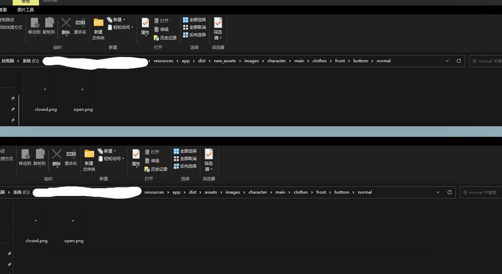

# DeepCreamPy Batch Processor

批量图片去码处理工具，基于[deepcreampy-fastapi](https://github.com/fajlkdsjfajdf/deepcreampy-fastapi)的自动化处理脚本

## 适用场景

- 我有一批带黑条的图片，只有少部分可猜测细节被遮挡，我希望能批量修复他们并且不影响原有命名顺序
- 我解包了一个游戏，找到了其带码的素材，我想批量转换他们但是素材太多了，分不清其文件结构，而且不想破坏原有素材的图层透明性（要指定-t参数，见下文透明背景恢复）
- 等等场景，作者做来主要是针对游戏解包素材再修复，如有需求可以交个issue我试试
- 仅适用于二次元图片
### 执行中

### 执行后文件夹结构与透明图层保留

### 执行效果与模型提供方相关，具体效果请自行测试
## 安装前置服务
首先你需要部署一个DeepCreamPy Fastapi服务，本项目基于其提供的api提供批量处理和透明识别，因此你必须在
[这里](https://github.com/fajlkdsjfajdf/deepcreampy-fastapi)
安装并运行这个服务，若能打开`http://localhost:8001/docs`则说明服务已经成功运行。
## 安装python依赖
接着安装python下的依赖，你当然有一个python环境才能执行上一步
在目录下打开cmd执行：
```bash
pip install -r requirements.txt
```
# 使用方法
在目录下打开cmd执行：
```bash
python main.py
```
可看到详细的参数介绍
如果你是本地部署的上述api服务且没有变动默认端口，则无需指定-u
最简单的使用范例（你必须指定-f参数）：
```bash
python main.py -f "C:\download\benzi"
```
这会新建一个new_benzi而不改变内部原文件夹结构
## 其他的处理模式
如只是单纯的抹除色块如图片中的纯色方块，即
```bash
python main.py -f "C:\download\benzi" -m 0
```
如果你觉得抹除马赛克后的部分太诡异，只需要简单抹除就好
```bash
python main.py -f "C:\download\benzi" -m 1
```
默认是模式2，即抹除马赛克并放大，可能会导致马赛克部分重新生成的地方有点怪异，尤其是厚码部分
剩下的两个模式仅为对接api，使用情况较少
## 透明背景恢复
该功能默认未启用，如果你处理的是游戏素材等很大可能是透明背景的图片，那么建议启用
```bash
python main.py -f "C:\download\benzi" -m 2 -t
```
## 断点续传
程序会自己跳过输出目录下同名文件，因而断点续传是可用的，如有必要也可选择自动覆盖同名文件

# 工具基于以下项目
[DeepCreamPy](https://github.com/cookieY/DeepCreamPy)
[hent-AI](https://github.com/natethegreate/hent-AI)
[deepcreampy-onnx-docker](https://github.com/nanoskript/deepcreampy-onnx-docker)

[deepcreampy-fastapi](https://github.com/fajlkdsjfajdf/deepcreampy-fastapi)
